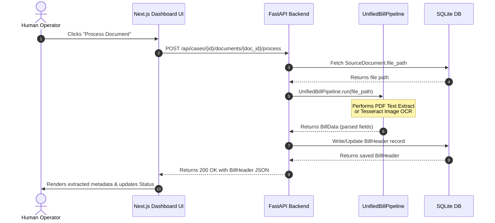

# PRODUCT-003: OCR / Extraction Integration Read-First Report

This report outlines the technical design, reusable modules, provider inventory, schema gaps, and integration plans for **PRODUCT-003 — OCR / Extraction Integration** within the municipal disbursement platform.

---

## 1. Architecture Summary

The existing system utilizes a decoupled pipeline architecture for processing invoices and utility bills. When a document is processed, it flows through a sequential, deterministic workflow:

```
[Document Upload] ──> [PDF Text Layer Check]
                           │
                           ├──> (Has Text) ───> [PyMuPDF Text Extract] ──────┐
                           └──> (No Text) ────> [Tesseract Image OCR] ──────┼──> [Text Cleanup]
                                                                            │
[Refined Bill Data] <── [Field Validation] <── [Provider Parser Refine] <────┘
```

The core backend architecture isolates database representations of cases and raw files from the extraction schemas:
*   **Database Projections**: SQLite manages state in `data/product.db` using SQLAlchemy models (`Case`, `SourceDocument`, `BillHeader`).
*   **Process Flow**: The processing logic resides under `src/workflows/unified_bill_pipeline.py`, which is fully decoupled from the API routes and UI views.
*   **Decoupled Schemas**: Dataclasses like `BillData` and `VerifiedBillData` capture the in-memory extraction payload before persistence.

---

## 2. Reusable Extraction Modules

A thorough forensic audit of the codebase reveals high-quality, pre-existing services and workflows that can be directly reused rather than rebuilt:

### Core Services
*   [PDFService](file:///d:/utility_automation_v2_light/src/services/ocr/pdf_service.py): Handles opening PDF files, text layer checking (`has_text_layer`), direct text extraction (`extract_text`), and page rasterization to PNGs (`render_pages_as_images`).
*   [OCRService](file:///d:/utility_automation_v2_light/src/services/ocr/ocr_service.py): Wraps `pytesseract` to run OCR on preprocessed image bytes.
*   [CleanupService](file:///d:/utility_automation_v2_light/src/services/ocr/cleanup_service.py): Fixes character errors (e.g. converting `O` -> `0`, `l` -> `1`), collapses spaces, and normalizes line breaks.
*   [FieldExtractorService](file:///d:/utility_automation_v2_light/src/services/extraction/field_extractor_service.py): Performs heuristic/regex extraction of Vendor (using `VendorDetector`), amounts (using `AmountParser`), and dates (using `DateParser`).

### Provider Refinement & Validation
*   [ParserRegistry](file:///d:/utility_automation_v2_light/src/services/provider_parsers/parser_registry.py): Matches detected vendors to specific downstream parsers.
*   **Provider Parsers**: Includes `NTParser`, `ElectricityParser`, and `WaterParser` to extract vendor-specific fields (e.g., CA accounts, billing numbers, service periods).
*   [ValidationWorkflow](file:///d:/utility_automation_v2_light/src/workflows/validation_workflow.py): Chains validators (`FieldValidator`, `AmountValidator`, `DateValidator`, `ConsistencyChecker`) to mark data confidence flag arrays.

### Orchestration Workflows
*   [UnifiedBillPipeline](file:///d:/utility_automation_v2_light/src/workflows/unified_bill_pipeline.py): Integrates OCR -> Field Extraction -> Provider Refinement -> Field Validation into a single execution command.

---

## 3. OCR / Provider Inventory

The platform is pre-configured with the following vendor templates and parsing capabilities:

| Provider/Vendor | Keywords Detected | Custom Extraction / Refinements | Key Identifiers |
| :--- | :--- | :--- | :--- |
| **NT (National Telecom)** | `NT`, `TOT`, `CAT` | Bill Number (10 digits) | `bill_number` |
| **Electricity (MEA/PEA)** | `การไฟฟ้า`, `กฟเน`, `กฟภ` | Customer Account (9-12 digits CA) | `account_number` |
| **Water (MWA/PWA)** | `การประปา`, `กปน`, `กปภ` | Service Usage Period (`DD/MM/YYYY - DD/MM/YYYY`) | `service_period` |

*   **Default Engine**: Tesseract OCR (`pytesseract`) using the Thai language pack (`lang='tha'`) with fallback to digital text layer parsing (PyMuPDF) if embedded font coordinates exist.

---

## 4. Schema & Database Gaps

While `PRODUCT-002` successfully implemented file uploads and `SourceDocument` registry, three critical schema gaps exist that must be bridged in `PRODUCT-003`:

1.  **Missing DB-to-Workflow Adapter**: The database has a `BillHeader` table, but there is no service to map the `BillData` dataclass (returned by `UnifiedBillPipeline.run()`) into a SQLite `BillHeader` database row.
2.  **Unmapped Extraction Fields**: `BillData` contains fields like `account_number`, `bill_number`, and `service_period` that have no corresponding columns in `BillHeader` (which only contains `provider`, `bill_date`, `total_amount`, `status`). We need to ensure we either store these in a new column or serialize them to JSON.
3.  **UI Response Serialization**: The `CaseDetailResponse` returned by `GET /api/cases/{case_id}` does not load or embed the processed `BillHeader` relation.

---

## 5. Integration Points

To integrate the OCR/Extraction workflow seamlessly without modifying legacy governance code, we identify the following extension boundaries:

### Backend (FastAPI Router)
*   **New API Endpoint**: `POST /api/cases/{case_id}/documents/{document_id}/process`
    *   Retrieves the target `SourceDocument`.
    *   Triggers `UnifiedBillPipeline.run(doc.file_path)` synchronously or in a background task.
    *   Creates/updates the `BillHeader` record in `data/product.db`.
*   **Case Details Payload**: Update `GET /api/cases/{case_id}` (in `src/product/api/cases.py`) to eagerly load the associated `BillHeader` details for each document:
    ```json
    {
      "id": 1,
      "case_number": "CASE-2569-0001",
      "documents": [
        {
          "id": 1,
          "file_name": "invoice.pdf",
          "document_type": "bill",
          "bill_header": {
            "provider": "Electricity",
            "bill_date": "2026-04-01",
            "total_amount": 3210.0,
            "status": "extracted"
          }
        }
      ]
    }
    ```

### Frontend (Next.js Detail Page)
*   **Location**: [cases/[id]/page.tsx](file:///d:/utility_automation_v2_light/frontend/product-ui/app/cases/[id]/page.tsx)
*   **Interaction Flow**:
    *   Add a **"วิเคราะห์เอกสาร (Process)"** button next to each document in the list.
    *   Show a loading skeleton or inline spinner while the API is processing.
    *   Once processing finishes, display the parsed fields (Vendor, Date, Amount, Status) directly on the UI.

---

## 6. Proposed PRODUCT-003 Scope

We propose a tightly scoped implementation plan limited strictly to extraction and UI integration:

*   **API Router**: Extend `src/product/api/documents.py` to add document processing API endpoint.
*   **DB Model Mapping**: Implement mapping utility to write extraction results to `BillHeader` DB rows.
*   **API Response**: Update `CaseDetailResponse` schemas to include nested `BillHeader` attributes.
*   **UI Views**: Upgrade `frontend/product-ui/app/cases/[id]/page.tsx` with process trigger buttons, status badges, and an inline parsed metadata panel.
*   **Tests**: Create `tests/product/test_ocr_extraction.py` to verify end-to-end endpoint logic.

---

## 7. Key Risks & Mitigations

*   **Risk 1: Tesseract Binary Dependency**:
    *   *Issue*: Running unit tests on environments without Tesseract OCR installed will fail when processing image-only PDFs.
    *   *Mitigation*: Unit tests in `tests/product/test_ocr_extraction.py` will mock `ProcessPDFWorkflow.run` or `pytesseract.image_to_string` to guarantee zero dependency on host OS configurations.
*   **Risk 2: Multi-page performance overhead**:
    *   *Issue*: Running OCR synchronously during a REST request can result in HTTP timeouts.
    *   *Mitigation*: Since these test documents are typical single or two-page bills, synchronous execution is acceptable. If larger files are processed, we should document background task offloading as a future phase.

---

## 8. Mermaid Implementation Flow



---

## 9. Context & Canonical Conflicts

During our `READ-FIRST` check, we audited all canonical documents under `docs/`.
*   **Conflict detected**: `docs/archive/TASK_039_S1_SUMMARY.md` lists deprecated CLI argument parameters that do not match current `start_runtime_task.py` logic.
*   **Resolution**: We strictly adhere to Tier 1 (`PROJECT_RULES.md`) and Tier 3 (`docs/CURRENT_RUNTIME_WORKFLOW.md`), which provide the authoritative latest commands for task execution.
